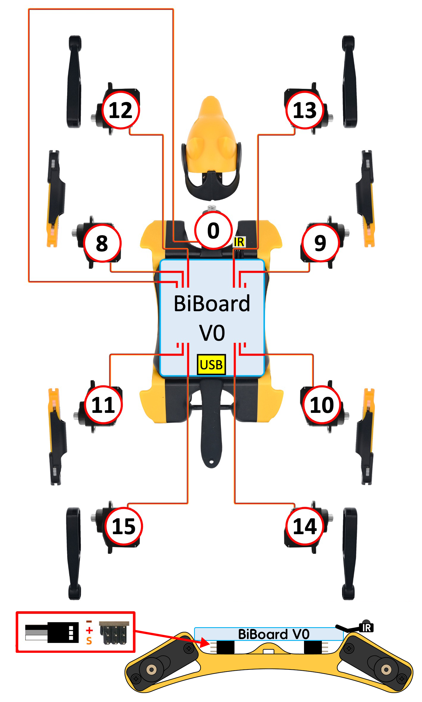

# Bittle X

<figure><figcaption></figcaption></figure>


A servo plug has three wires. Plug it in the right direction or you may burn the chip. The color of wires may vary for different models. However, the darkest-colored (Black or Brown) wire (GND for ground) is always the GND wire as a convention. The GND wire should be plugged closest to the board.&#x20;



The index number of the joint servo has **no corresponding relationship** with the PWM pin number on the main board. **You don't even need to read the pin numbers on the PCB board.**&#x20;

