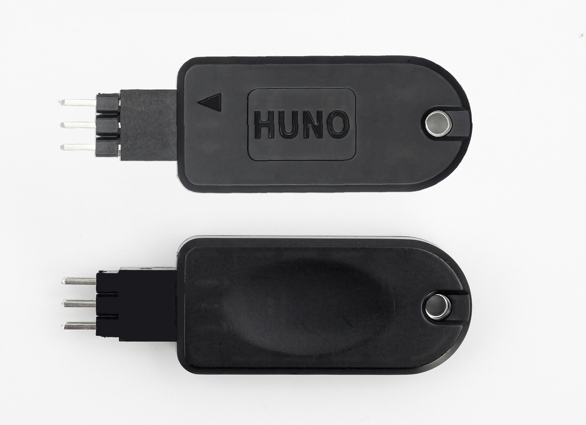
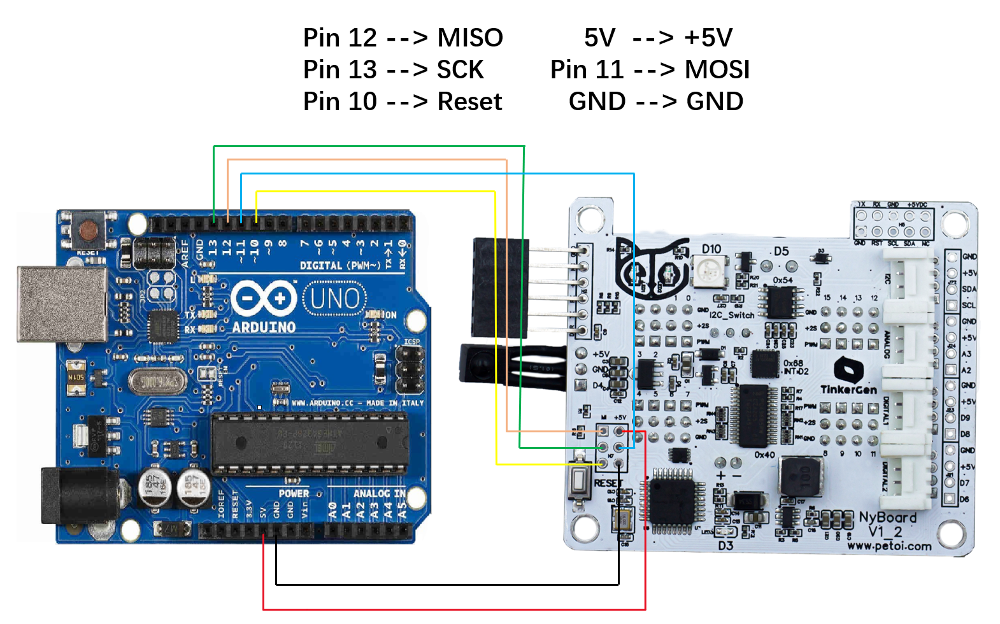
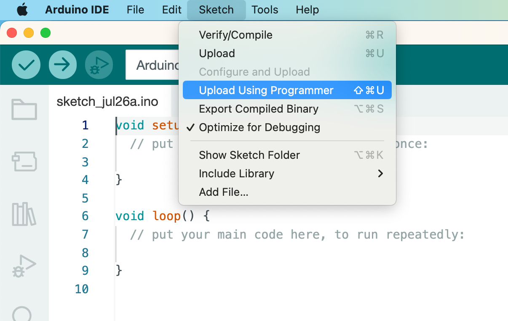

# 🔧 Burn Bootloader for NyBoard

If you cannot upload sketches to the NyBoard (the "not in sync error") and verify that the serial connection is all good, the NyBoard's bootloader might be crashed during the last upload.&#x20;


Verify that the serial connection is all good means:

1. The USB cable has data wires rather than just the power wires. The USB cable included in the Petoi package should be good.&#x20;
2. You have the proper driver for the uploader, or your computer can automatically install the driver. You can see and select the serial port in the Arduino IDE -> Tools -> Port.
3. All the contacts along the loop are connected firmly.&#x20;
4. You have successfully uploaded sketches previously.


There could be several reasons why the NyBoard's bootloader crashes. Some of the common causes include:

1. Uploading the sketch at a high baud rate
2. Using a malfunctioning USB cable
3. Using a power source that is not sufficient
4. Using a low-quality or damaged Uno board
5. Disrupting the upload process by pressing the reset button or unplugging the board
6. Memory overflow

In the specific case of Petoi robots, the sketch size and errors in the code are major causes of the crashed bootloader. Uploading a sketch to the Uno replaces the existing bootloader code with the new sketch. If the sketch is too large to fit in the memory or if there are errors in the code causing memory overflow, the bootloader may corrupt.&#x20;

## Use the Simple Bootloader Resetter

From August 2023, we will ship a simple bootloader resetter with the NyBoard. If you got an earlier batch and need to reset the bootloader, please write to [support@petoi.com](mailto:support@petoi.com) to request a free shipment.&#x20;

<figure><figcaption></figcaption></figure>




The old version:

 





If the light ends up <mark style="color:red;">red</mark>, it means the resetting operation fails. It's probably a malfunction of either the NyBoard or the bootloader resetter.


## Use Arduino UNO Board

1.  &#x20;Open the sketch **ArduinoISP.ino**. 

    <figure><figcaption></figcaption></figure>
2.  &#x20;Select the items in the menu bar **Tools > Board** (Arduino UNO) and **Port** that connect to the UNO board. 

    <figure><figcaption></figcaption></figure>

    <figure><figcaption></figcaption></figure>

    <figure><figcaption></figcaption></figure>
3.  &#x20;Upload the sketch **ArduinoISP.ino** to the **UNO** board. 

    <figure><figcaption></figcaption></figure>
4.  &#x20;Wire the UNO board with NyBoard. 

    <figure><figcaption></figcaption></figure>
5.  &#x20;Select the **Arduino as ISP** in the menu bar **Tools>Programmer**. 

    <figure><figcaption></figcaption></figure>
6.  &#x20;Click the menu **Burn Bootloader**. 

    <figure><figcaption></figcaption></figure>


At Step 6, you'd better push the jumpers with your fingers to ensure good contact.

.png>)





Since the NyBoard uses the same chip as a regular Arduino Uno, if you have two Nyboards, you can use one as a **programmer**(upload the sketch **ArduinoISP.ino**) to burn the bootloader to another one as the **target**. The steps are similar to the above, but you need to assign the **RESET** pin to 6 in the **ArduinoISP.ino** as follows:

.png>)\
The jumper connection is as follows:\
.png>)


## Use USBtinyISP or USBasp

* USBtinyISP\
  .png>)    .png>)

Connect the USBtinyISP programmer and NyBoard.  The pins connection map is as follows:

MI --> MISO          V --> VCC

SC --> SCK        MO --> MOSI

R --> Reset           G --> GND

Connect the USBtinyISP programmer to the computer with a USB port. After installing the driver as follows:

<figure><figcaption></figcaption></figure>

The driver is as follows:



With NyBoard V1\_\*, you can simply choose **Arduino Uno** under the **Tool** menu of Arduino IDE, then burn the bootloader as follows:

<figure><figcaption></figcaption></figure>


While Burning the bootloader, you'd better push the UsbtinyISP with your fingers to ensure good contact.

.png>)




* USBasp\
  .png>)     

Connect the USBasp programmer and NyBoard. The pins connection map is as follows:

MISO --> MISO       VCC --> VCC

SCK --> SCK           MOSI --> MOSI

Reset --> Reset      GND --> GND

Connect the USBasp programmer to the computer with a USB port. Afer installing the driver as follows:

<figure><figcaption></figcaption></figure>

The driver installer is as follows:



With NyBoard V1\_\*, you can simply choose **Arduino Uno** under the **Tool** menu of Arduino IDE, then burn the bootloader as follows:

<figure><figcaption></figcaption></figure>


The socket from the USBasp programmer to ICSP on NyBoard is not compatible. In this case, You need to use female-to-male jumper wires to connect the pins on each side as follows (It's a one-time operation, so there is no need for soldering)\

While Burning the bootloader, make sure they have good contact. You can press the jumpers slightly to ensure the connections.


For details about how to use the USBasp programmer, you can refer to:



## \* Upload sketches using a Programmer&#x20;


You may also use the Programmer to upload sketches to the board.&#x20;

It allows larger sketches because the bootloader takes about 2 KB on the flash. However, it will overwrite the default bootloader, and you WON'T be able to upload sketches using the regular USB uploader. And uploading sketches using the programmer is also slower. So it's not recommended unless your serial uploading routine is broken.&#x20;

