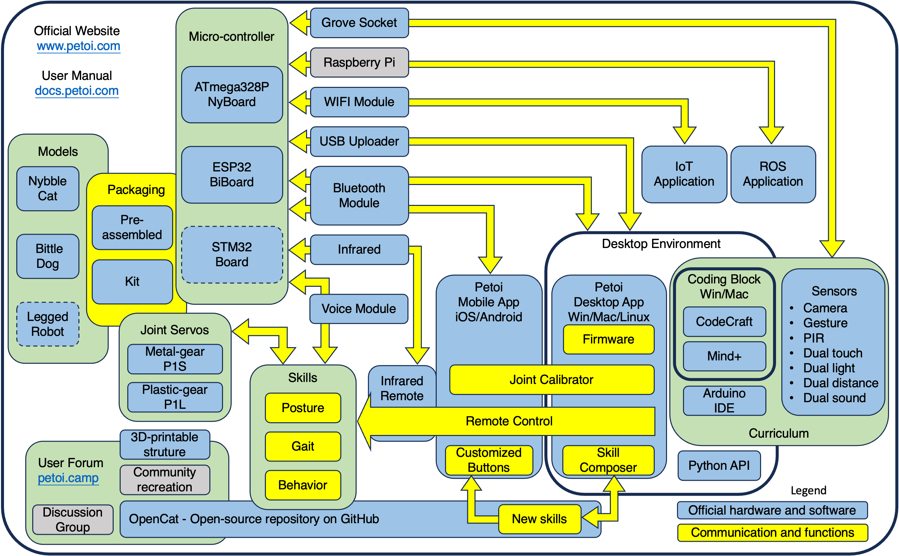

# 💾 Supporting Application and Software

## Products and Framework

<figure><figcaption></figcaption></figure>

## Programming Language Support

* Coding can be done in C-style language with the [Arduino IDE](https://www.arduino.cc/en/software).&#x20;
* [Python API for sending serial commands](https://github.com/PetoiCamp/OpenCat/tree/main/serialMaster)
* Bittle X/ Bittle / Nybble can be programmed with a Scratch-like IDE [**Mind+**](https://docs.petoi.com/block-based-programming/petoi-coding-blocks). we also provide a free sample [curriculum](https://drive.google.com/drive/folders/1vcdMiLY90WVypL1oHU-082e1qkAn8qW7).


Bittle can be programmed with a Scratch-like web-based IDE [Codecraft](http://ide.tinkergen.com/). You may find some complementary materials: [online help](https://www.yuque.com/tinkergen-help-en/bittle) and [curriculum](https://www.yuque.com/tinkergen-help-en/bittle\_course).

Note that **Codecraft** doesn't support OpenCat 2.0.  You'd need to use [OpenCat 1.0](https://github.com/PetoiCamp/OpenCat/tree/1.0) instead.


## 3rd-party Open Source Projects

* [Inverse Kinematic Model OpenCat](https://github.com/ger01d/kinematic-model-opencat)
  * [a discussion thread](https://www.petoi.camp/forum/software/kinematic-model-of-nybble-and-bittle)
* [OpenCatWeb](https://github.com/leukipp/OpenCatWeb) - a web interface to control Opencat-based robots
  * need to mount a Raspberry Pi
  * [a discussion thread](https://www.petoi.camp/forum/software/web-api-to-control-nybble-opencatweb) by the author leukipp
*   [The Code & Robots iOS app](http://www.codeandrobots.com/) can control a few open source Robots, including Bittle.

    Please check out the following video for the app configuration to support controlling Bittle.


