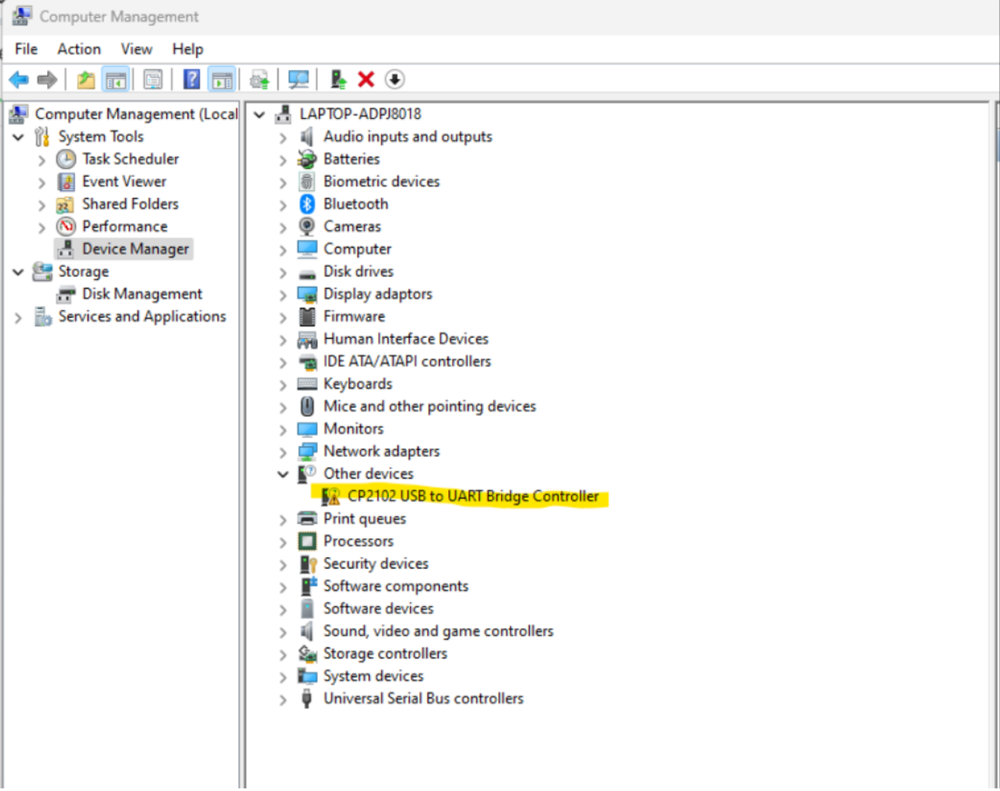
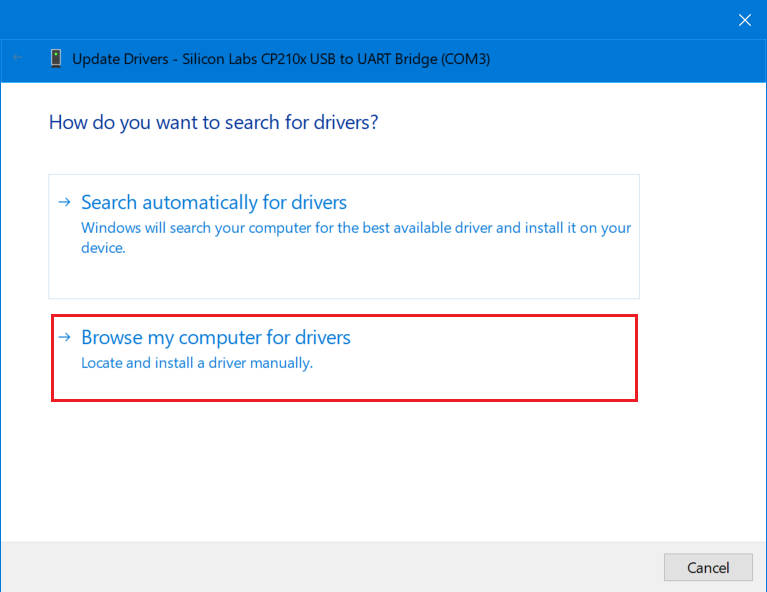
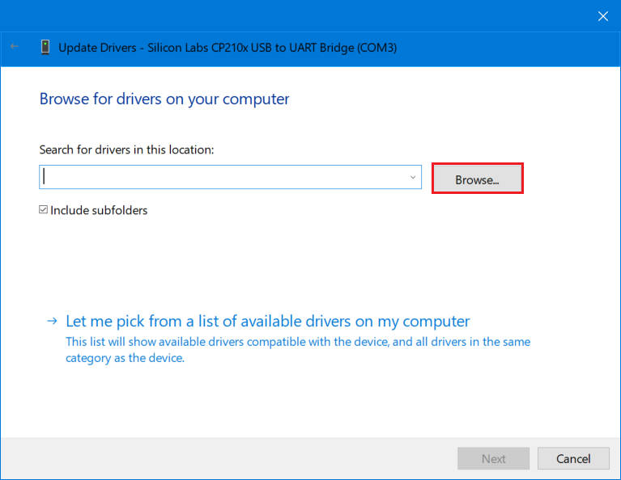
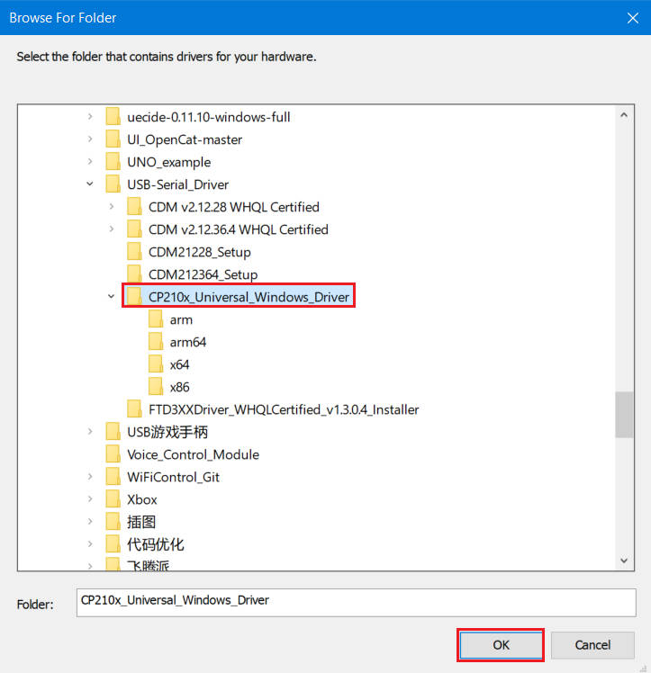
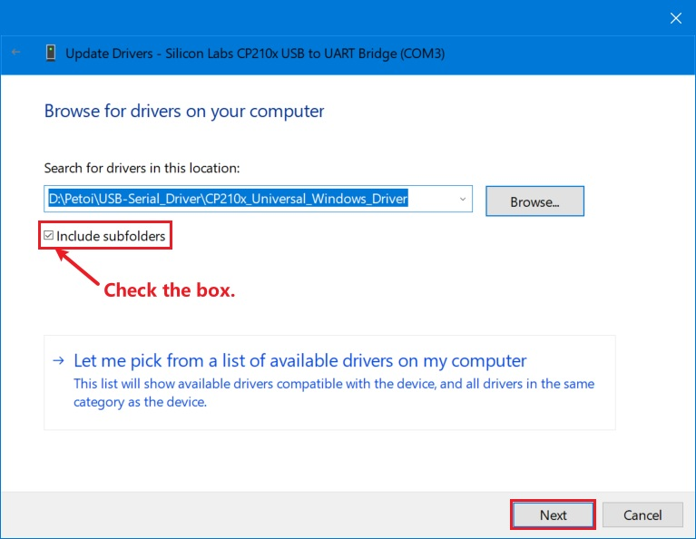
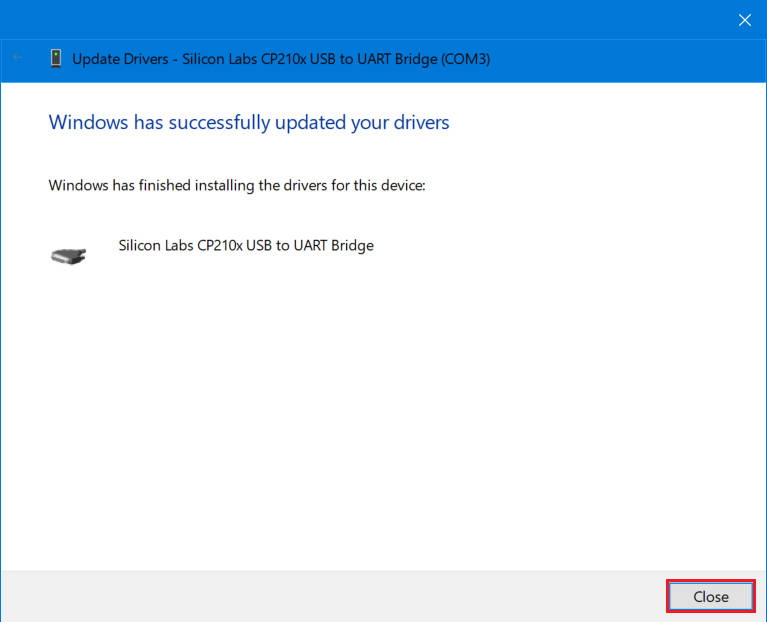
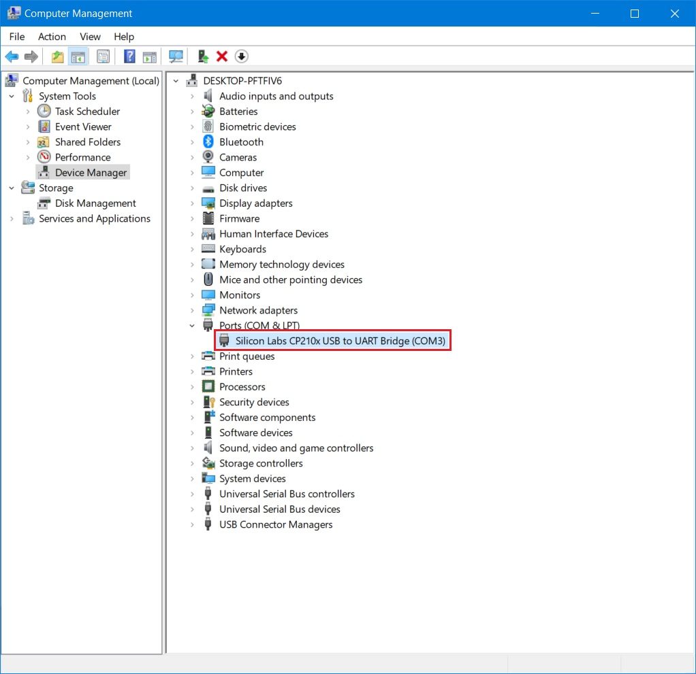

# 🛠️ Useful Tools

## USB Driver

### NyBoard USB Driver to access the USB uploader (adapter)

When you use a [USB uploader](https://docs.petoi.com/communication-modules/usb-downloader-ch340c) to upload the firmware for **NyBoard**, please download and install the driver first:

* Mac: [http://www.wch-ic.com/download/CH341SER\_MAC\_ZIP.html](http://www.wch-ic.com/download/CH341SER_MAC_ZIP.html)
* Windows: [https://www.wch-ic.com/downloads/CH341SER\_ZIP.html](https://www.wch-ic.com/downloads/CH341SER_ZIP.html)
* Linux: [http://www.wch-ic.com/downloads/CH341SER\_LINUX\_ZIP.html](http://www.wch-ic.com/downloads/CH341SER_LINUX_ZIP.html)

For example, for Windows:

<figure><figcaption></figcaption></figure>

### BiBoard V0 USB Driver to access the serial port&#x20;

When you use a **USB Type-C**  interface data cable to upload the firmware for BiBoard or control the robot via the [**Petoi Desktop App**](https://docs.petoi.com/desktop-app/introduction), please download the driver as below:



For example, for Windows:

<figure><figcaption></figcaption></figure>

#### Mac

You can download the Mac version and run the \*dmg file to install it. During the installation, you need to allow the permission settings.&#x20;

#### Win

For Windows, the installation steps are as follows:

<figure><figcaption></figcaption></figure>

In the **Device Manager**, if you open the Other devices list, you may see a CP210X device with a triangle exclamation sign. Right-click it to find the "**update driver**" option, then select the unziped folder of your downloaded driver to install.

<figure><figcaption></figcaption></figure>

<figure><figcaption></figcaption></figure>

<figure><figcaption></figcaption></figure>

<figure><figcaption></figcaption></figure>

<figure><figcaption></figcaption></figure>

<figure><figcaption></figcaption></figure>

### BiBoard V1 USB Driver to access the serial port


Some USB cables are just for charging and do not have data transfer capability. Using the original data cable in the kit is better for making the uploading successful. &#x20;


When you use a USB type-C data cable to upload the firmware for the **mainboard.**

* In Windows, if there is **no** serial port in the port list of **Device Manager**:

<figure><figcaption></figcaption></figure>

* In Mac, open the **Terminal** program under the **Applications**-**Utilities** folder and type the following commands. If no serial device name starting with "_**tty.wchusbserial**_" is found:

<figure><figcaption></figcaption></figure>

#### Please download and install the USB driver:

* Windows: [https://www.wch-ic.com/downloads/CH343SER\_EXE.html](https://www.wch-ic.com/downloads/CH343SER_EXE.html)
* Mac: [https://www.wch-ic.com/downloads/CH34XSER\_MAC\_ZIP.html](https://www.wch-ic.com/downloads/CH34XSER_MAC_ZIP.html)


For ChromeOS:

1. &#x20;Download the Arduino IDE(e.g. 1.8.19) for Linux from [https://github.com/arduino/Arduino/releases/download/1.8.19/arduino-1.8.19.tar.xz](https://github.com/arduino/Arduino/releases/download/1.8.19/arduino-1.8.19.tar.xz)
2. &#x20;Install it on the Chromebook. Please refer to the video at [https://www.youtube.com/watch?v=2cve6n4LZqI](https://www.youtube.com/watch?v=2cve6n4LZqI)
3. &#x20;Plug the Bittle USB type-C data cable into the robot and the Chromebook.
4. Set the Chromebook Linux VM to recognize the USB port

&#x20;      Settings => Advanced => Developers => Linux development environment => Manage USB devices => USB Serial (turn on)

NOTE: Step 4 must be repeated whenever the USB connection is reconnected/powered on.

