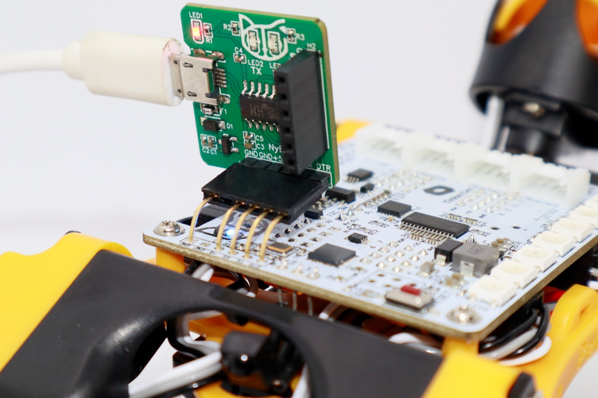

# Upload Firmware

## Connect to the mainboard.


* Some USB cables are just for charging and do not have data transfer capability. Using the original data cable in the kit is better for making the uploading successful. &#x20;
* Some new laptops only have USB-C ports, so users use a hub to connect standard USB-B to their computers. However, the intervening hubs prevent the app from recognizing the serial port. The solution was to connect the USB-C cable DIRECTLY to the computer using EITHER a USB-C to USB-C cable OR a tiny C to B adaptor (not a hub).


### NyBoard

When you use a [USB uploader](https://docs.petoi.com/communication-modules/usb-downloader-ch340c) to upload the firmware for the **NyBoard**,  if there is **no** serial port in the port list of Device Manager.&#x20;

<figure><figcaption>
Nybble
</figcaption></figure> <figure><figcaption>
Bittle
</figcaption></figure>

<figure><figcaption></figcaption></figure>

Please download and install the USB driver:

* Mac: [http://www.wch-ic.com/download/CH341SER\_MAC\_ZIP.html](http://www.wch-ic.com/download/CH341SER_MAC_ZIP.html)
* Windows: [http://www.wch-ic.com/downloads/CH341SER\_EXE.html](http://www.wch-ic.com/downloads/CH341SER_EXE.html)
* Linux: [http://www.wch-ic.com/downloads/CH341SER\_LINUX\_ZIP.html](http://www.wch-ic.com/downloads/CH341SER_LINUX_ZIP.html)

### BiBoard V0

When you use a USB type-C data cable to upload the firmware for the **BiBoard**,  if there is **no** serial port in the port list of Device Manager.&#x20;


Note: The connection for uploading firmware is to be made directly to the **BiBoard** and NOT to the outside charging port on the battery.


<figure><figcaption>
Bittle X
</figcaption></figure>

<figure><figcaption></figcaption></figure>

Please download and install the USB driver:



For more details, please refer to the [BiBoard V0 USB Driver to access the serial port](https://docs.petoi.com/technical-support/useful-tools#biboard-driver-to-access-the-serial-port).

### BiBoard V1

When you use a USB type-C data cable to upload the firmware for the mainboard **BiBoard V1.**

* In Windows, if there is **no** serial port in the port list of **Device Manager**:

<figure><figcaption></figcaption></figure>

* In Mac, open the **Terminal** program under the **Applications**-**Utilities** folder and type the following commands. If no serial device name starting with "_**tty.wchusbserial**_" is found:

<figure><figcaption></figcaption></figure>

#### Please download and install the USB driver:

* Windows: [https://www.wch-ic.com/downloads/CH343SER\_EXE.html](https://www.wch-ic.com/downloads/CH343SER_EXE.html)
* Mac: [https://www.wch-ic.com/downloads/CH34XSER\_MAC\_ZIP.html](https://www.wch-ic.com/downloads/CH34XSER_MAC_ZIP.html)

For the macOS(from the version _**Sequoia**_), after installing the driver, you need to enable the driver, as follows:

**Settings** -> **General** -> **Login Items** & **Extensions** -> **Driver Extensions**

<figure><figcaption></figcaption></figure>

## Upload the firmware

There are two methods to Upload the firmware to the robot:

* The simplest method is to use the [**Petoi Desktop App**](https://docs.petoi.com/desktop-app/introduction). No programming is involved. You can play with some preset modes.&#x20;
* If you have some programming experience, you can use the [**Arduino IDE**](https://www.arduino.cc/en/software)[.](https://www.arduino.cc/en/software) You will be able to modify the open-source codes for your new projects.&#x20;
  * If you are using NyBoard, please refer to [**Upload Sketch for NyBoard**](https://docs.petoi.com/arduino-ide/upload-sketch-for-nyboard).
  * If you are using BiBoard, please refer to [**Upload Sketch for BiBoard**](https://docs.petoi.com/arduino-ide/upload-sketch-for-biboard).


If you have a NyBoard(with Bittle and Nybble), we highly recommend using the green USB programmer to upload the firmware. The Bluetooth dongle is not as stable and may cause the mainboard's bootloader to crash if interrupted in the middle.&#x20;

For BiBoard(with Bittile X), the USB/Bluetooth connections are built on the board already.

