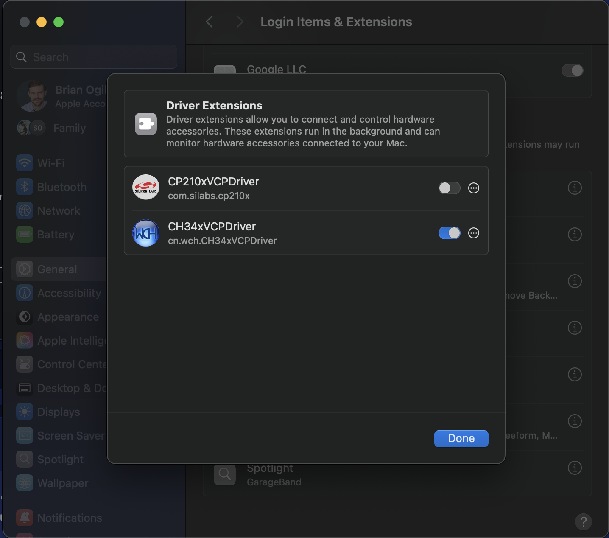

# BiBoard V1

When you use a USB type-C data cable to upload the firmware for the mainboard **BiBoard V1.**

\[picture of USB data connection]

* On Windows, if there is **no** serial port in the port list of **Device Manager**:

<figure><figcaption></figcaption></figure>

*   On Mac, open the **Terminal** program under the **Applications**-**Utilities** folder and type the following commands. If no serial device name starting with "_**tty.wchusbserial**_" or "_**cu.wchusbserial**_" is found:

    ```
    cd /dev
    ls
    ```

#### Please download and install the USB driver:

* Windows: [https://www.wch-ic.com/downloads/CH343SER\_EXE.html](https://www.wch-ic.com/downloads/CH343SER_EXE.html)
* Mac: [https://www.wch-ic.com/downloads/CH34XSER\_MAC\_ZIP.html](https://www.wch-ic.com/downloads/CH34XSER_MAC_ZIP.html)

For the macOS(from the version _**Sequoia 15.1**_), after installing the driver, you need to enable the driver, as follows:

**Settings** -> **General** -> **Login Items** & **Extensions** -> **Driver Extensions**

<figure><figcaption></figcaption></figure>
