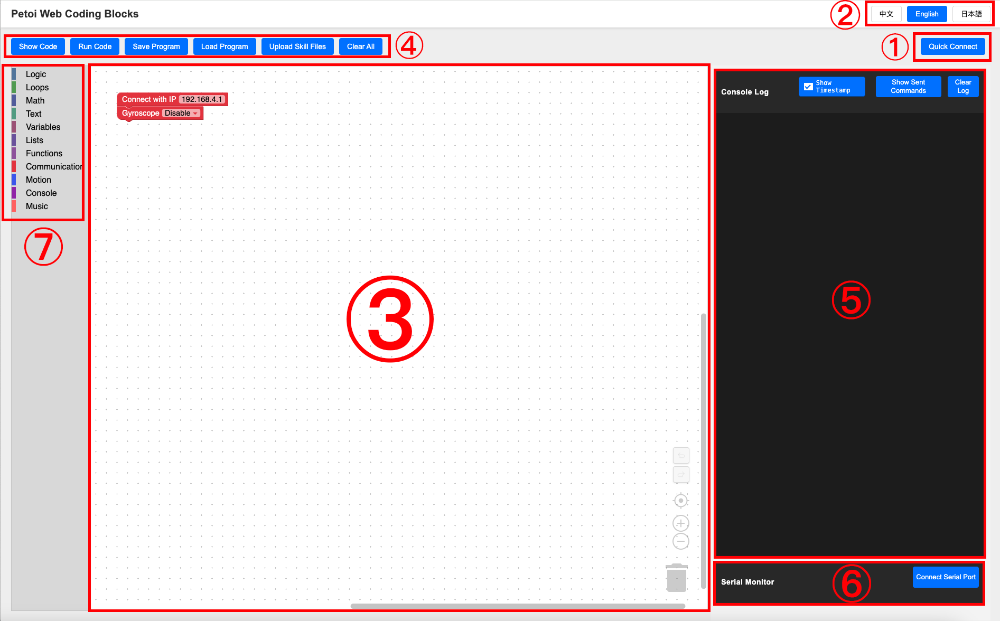
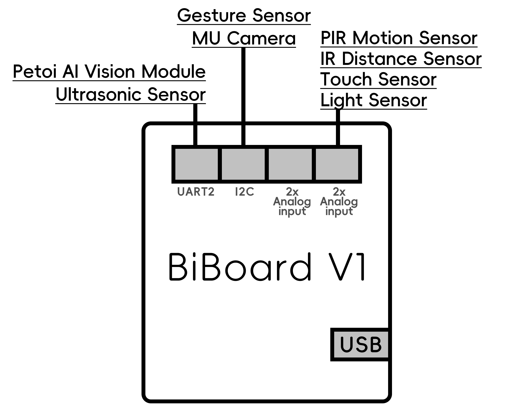

# Petoi Web Coding Blocks

## 1. Upgrade the firmware

You can [upgrade the firmware](../desktop-app/firmware-uploader/) for BiBoard, which supports web block-based programming via the latest version (≥ 1.2.6 beta) of the Petoi Desktop App.

## 2. Open the Petoi Web Coding Block

Download the source code from the GitHub repository ([OpenCatEsp32-Quadruped-Robot](https://github.com/PetoiCamp/OpenCatEsp32-Quadruped-Robot/tree/redesignWeb)).

<figure><figcaption></figcaption></figure>

Open **OpenCatEsp32 > PetoiWebBlock > programblockly.html** to start programming with Petoi Web Coding Block on web.

<figure><figcaption></figcaption></figure>

<figure><figcaption></figcaption></figure>


**Note:**&#x20;

1. You'd better open **programblockly.html** using:
   1. **Edge** on Windows
   2. **Chrome** on Chromebook
2. Ensure the browser is in **direct connection mode.**
3. It's best not to use a VPN, as it may slow down the response speed and impact the experience. Please turn off the VPN extension.\
   .png>)


## 3. The principle and process

The Petoi Web Coding Block allows you to control the robot via WiFi without compiling and uploading code to its main board. Simply click the "Run Code" button to execute the program at the graphical block level, sending instructions wirelessly to the robot through your local network. The process involves three key steps:

1. &#x20;Open the serial port
2. &#x20;Control the robot
3. &#x20;Close the serial port


If you use the **Chrome**, please make sure to turn on the permission settings:\
.png>)\
\
.png>)\
\
.png>)


The Petoi web coding block interface is shown below:

<figure><figcaption></figcaption></figure>

① [Quick Connect](petoi-web-coding-blocks.md#id-3.1-initial-setup-and-quick-connect) ② [Language Switch](petoi-web-coding-blocks.md#id-3.2-language-switch) ③ [Workspace](petoi-web-coding-blocks.md#id-3.3-workspace) ④ [Action Buttons](petoi-web-coding-blocks.md#id-3.4-action-buttons) ⑤ [Console](petoi-web-coding-blocks.md#id-3.5-console) ⑥ [Serial Monitor](petoi-web-coding-blocks.md#id-3.6-serial-monitor) ⑦ [Toolbox & Blocks](petoi-web-coding-blocks.md#id-3.7-toolbox-and-blocks)

### **3.1 Initial Setup & Quick Connect**

For first-time use, you need to establish a connection between your robot and computer. **Both must be on the same WiFi network, and the robot can only connect to 2.4GHz WiFi networks.** Therefore, you need to split your WiFi SSID into two frequency bands.&#x20;

**Follow these steps to split your WiFi bands:**

1. Access your router’s Wireless Settings page (access method typically found on the router’s label).
2. In the **2.4GHz settings**, change the Wi-Fi name (SSID) to `xxx-2.4G` and save.
3. In the **5GHz settings**, change the SSID to `xxx-5G` and save.
4. After renaming, both `xxx-2.4G` and `xxx-5G` will appear in your device’s WiFi list.


Note: Since the Wi-Fi names have changed, all devices connected to this router need to reconnect. If you didn’t change the password, it remains the original password.


#### **Connection Procedure**

Connect the robot’s mainboard to your computer via **USB cable**.

<figure><figcaption></figcaption></figure>

There are two methods to connect the robot to your 2.4GHz WiFi network:

1. (Recommended)
   * Click  button on the webpage, select a serial port of the robot in the pop-up window and click "Connect" button. _(For Mac user, different from_ [_firmware upload_](petoi-web-coding-blocks.md#id-1.7-connect-to-biboard-via-usb-type-c-data-cable)_, any serial port of the robot works here)_
   * Enter your `xxx-2.4G` WiFi credentials when prompted. The robot will connect to your network like any standard device, then automatically reboot its mainboard. \
     Once rebooted, the red block `Connect with IP:192.168.4.1` in the workspace will auto-update with your actual IP, indicating successful connection. You can use Petoi Web Coding Block to send real-time signals to the robot via WiFi from now!
2.

    * Click .png>) button in the serial monitor on the webpage to establish a serial connection with the robot.&#x20;
    * Press and hold the BOOT button on the robot’s mainboard until the 10-second countdown in the serial monitor’s output ends. This will initiate the network reset procedure.&#x20;
    * When the serial output displays "wm:Starting Web Portal", the serial output will pause. This indicates that the robot has created a new hotspot and entered **a waiting state for connection**.\
      .png>)
    * At this point, open your computer’s WiFi network list and locate the newly appeared, password-free network. The network name is typically "**UII WifiConfig**." \
      .png>)
    *   After connecting, a WiFi Manager window will open. Follow the prompts to select your 2.4GHz network, enter the username and password, and wait for the connection to complete. The window will close automatically once connected.

        <figure><figcaption></figcaption></figure>

        <figure><figcaption></figcaption></figure>

        <figure><figcaption></figcaption></figure>

        <figure><figcaption></figcaption></figure>


**Note:** If you cannot find the new password-free network in the WiFi list, please try refreshing the list multiple times. If it still does not appear, check the robot’s serial output to confirm whether the robot remains in **the waiting state**. If not, the hotspot has been deactivated, and you will need to restart the network reset procedure.


#### **Persistent Connection**

**This entire process only needs to be set up once.** The robot remembers your WiFi credentials.

For future connections, You only need to use **either one** of the following methods to connect :

* **Wireless**: Enter the current IP in the `Connect with IP` block (check via USB if IP changes).
* **Wired**: Connect the robot to the computer via USB cable, then send command `w` to the serial port for auto-connection.


**Note**:&#x20;

The connection relies on the local network environment. Ensure it is always on the same WiFi network as your computer during every subsequent connection. Your network IP address **may not always remain unchanged**. If you entered the IP address directly in the workspace block but failed to connect, please consider possible IP address changes. You may:

Connect the robot’s serial port to the computer via USB cable. Send command **w** through Petoi Web Coding Block to the serial port to check and update the IP address.


### **3.2 Language Switch**

<figure><figcaption></figcaption></figure>

You can switch language systems here anytime.

### 3.3 **Workspace**

This is the area where you assemble block programs. You can scroll the mouse wheel to zoom in/out.

<figure><figcaption></figcaption></figure>

Press and hold the left mouse button on a blank area to pan the view. Right-click to perform actions like undoing block operations.

<figure><figcaption></figcaption></figure>

Left-click and hold a block to drag its position. Right-click a block to copy or delete it.

<figure><figcaption></figcaption></figure>

The buttons at the bottom-right :

From top to bottom: **Undo • Redo • Center View • Zoom In • Zoom Out • Trash Bin**

You can drag blocks onto the Trash Bin here to delete them. Click the Trash Bin to view deletion history, the blocks inside can be dragged back to the workspace.


Alternative deletion methods:

* Right-click a block → choose "delete block".
* Drag blocks to the **Toolbox** area.
* Left-click a block → press "Delete" on your keyboard.


The Workspace contains two default blocks that **cannot be deleted** :

`Connect with IP`: Essential block for program execution. Only blocks connected **under** it will run.\
`Gyroscope` : Disables robot's gyroscope during program execution by default.


Robots' gyroscope status varies by users' usage habits. If it's enabled during runtime, the robot will automatically adjusts balance in real-time, which may interfere with your program's intended behavior. To ensure consistency, gyroscope is disabled at program start.

_To enable_: Simply change "disable" to "enable".


### **3.4 Action Buttons**

<figure><figcaption></figcaption></figure>

.png>) **Show Code**: Displays source code of blocks connected under the `Connect with IP` block.

.png>) **Run Code**: Executes all blocks connected under the `Connect with IP` block.

.png>) **Save Program**: Saves current project state (all blocks + skills) as a **.json** file.

.png>) **Load Program**: Loads the **.json** project you saved.

.png>) **Upload Skill Files**: Adds skill files to project (details: xxx).

.png>) **Clear All**: Removes all blocks **except** default blocks `Connect with IP` and `Gyroscope` on the workspace. Cleared blocks will appear in Trash Bin history.

### **3.5 Console**

<figure><figcaption></figcaption></figure>

You can view real-time program execution messages here. It's critical when controlling wirelessly, console can provides vital feedback as serial port data is inaccessible.

.png>) Use this button to toggle the timestamp display in the Console on/off. When you need to copy batches of sensor data output to the console, turning off timestamps makes it easier.

### **3.6 Serial Monitor**

<figure><figcaption></figcaption></figure>

View serial print messages from connected robots here and send commands directly to the serial port.

When you successfully connect to the robot's serial port, the Serial Monitor window will automatically open as shown above.


Note:

Without a USB cable connection between the robot and computer, serial data cannot be accessed or sent here.


### **3.7 Toolbox & Blocks**

<figure><figcaption></figcaption></figure>

Left-click any category in the Toolbox to reveal all its blocks. Drag and place them in the Workspace, then link to blocks under `Connect with IP` to assemble your program.

The **Communication**, **Motion**, **Console**, and **Music** categories contain blocks created and provided by Petoi. All other blocks are default functional blocks from Blockly.\

## 4 The instructions for blocks

### 4.1 Communication

The blocks in **Communication** are used for interacting with various modules of the robot.

For detailed instructions on sensor connections, please refer to the individual sensor documentation in the "[EXTENSIBLE MODULES](broken-reference)" section. Only basic connection diagrams and pin number references are provided here for your guidance.

<figure><figcaption></figcaption></figure>

The pin numbers required when using building blocks can be referenced against the labels next to the Grove Sockets on your BiBoard.

<figure><figcaption></figcaption></figure>

* For **general modules** (Light Sensor, Touch Sensor, Gesture Sensor, PIR Motion Sensor, IR Distance Sensor), You can use the above four blocks to **digitally/analog read/write signals** and see the results in both the serial monitor and console. \
  Analog value range: 0\~255\
  Digital value range: High-level: 1; Low-level: 0
*   .png>)

*   For the **Ultrasonic Sensor**, use this block to read the distance value. You can set the two pins ( Trigger and Echo) like this: (BiBoard V1 connects to the Rx and Tx pins)

    
<figure><figcaption></figcaption></figure>

*   For **camera modules** (MU Camera, Petoi AI Vision Module), use this block to Read the coordinates of the identified target from the camera module.

    
<figure><figcaption></figcaption></figure>

*   If you are familiar with Petoi's **serial commands** (e.g., `m 0 60` rotates servo #0 to 60°), you can use this block to send serial commands to robot during program execution.

    .png>)\
    You can also input "**kkcL**" (kick the left front leg), and "**khiR**" (raise the right front leg to say hello). For more serial port commands, please refer to [the serial protocol](https://docs.petoi.com/api/serial-protocol).&#x20;
*   Use this block to enable/disable the robot's gyroscope:

    
<figure><figcaption></figcaption></figure>

    Enabled: The robot adjusts motion balance in real-time and performs self-righting when tilted over.

    Disabled: The robot executes only specified movements without auto-balancing.

### 4.2 Motion

The blocks in **Motion** are used for controlling robot actions and reading/writing servo joint angle signals.

#### **Preset Actions**:

*   This block enables the robot to execute various preset gaits for movement in various directions/poses. You can modify the  `delay` duration for continuous walking.

    
<figure><figcaption></figcaption></figure>

*   This block makes the robot perform various preset poses.

    
<figure><figcaption></figcaption></figure>

*   This block performs advanced preset motions. Due to large movement ranges, please use cautiously especially when using with USB-connected robot or Bittle X+Arm.

    
<figure><figcaption></figcaption></figure>

*   This block controls preset robotic arm motions (Bittle X+Arm only).

    
<figure><figcaption></figcaption></figure>

**Custom Actions**:

*   Use these two blocks to get the robot's current joint angles. You can assign it to a variable first and then use the variable and algorithm to control other joints to rotate.

    
<figure><figcaption></figcaption></figure>


The return value of the blocks are only angle values, which cannot be filled in the "Turn sequentially" and "Turn simultaneously" blocks alone.


*   These two blocks can both set a single joint angle individually. You can set the joint angle to an absolute value, or  to a relative angle value. increase it, or decrease it by a specific number.&#x20;

    You can even creatively make the angle change using a formula or variable instead of a fixed number.

    
<figure><figcaption></figcaption></figure>

*   Combine these four blocks to move **multiple joints** sequentially or simultaneously.

    
<figure><figcaption></figcaption></figure>

    \
    You can click the **gear icon**.png>), then change the list length in the pop-up window to apply it to the actual block.

    
<figure><figcaption></figcaption></figure>

*   Use these two blocks to control all joints to rotate at the same time.&#x20;

    <figure><figcaption></figcaption></figure>


The "Action frame" block represents a list of 16 angle values. Each angle value corresponds to the absolute angle value to which the corresponding [joint index](https://app.gitbook.com/o/-M-_eWZUjFA4usjshHcZ/s/-MQ6a951Q6Jn1Zzt5Ajr-887967055/~/changes/285/petoi-robot-joint-index) servo rotates.


*   This block executes **uploaded skill files** by entering the full filename (e.g., `test.md`).

    
<figure><figcaption></figcaption></figure>

    You can create skill files by using the [Skill Composer](https://docs.petoi.com/desktop-app/skill-composer#export-the-skill).&#x20;


Tips: you can also copy & paste the [SkillLibrary](https://github.com/PetoiCamp/OpenCat/tree/main/SkillLibrary) folder from the source code of the OpenCat project on GitHub to the _**.config/Petoi**_ directory. Therefore, you can use some sample skills for your program, and there is no need to use the export function in the Skill Composer.

.png>)



The folder **.config** is a hidden directory on MacOS/Linux but can be visited in the terminal or through a specific view setting:

*   MacOS\
    open the directory /Users/{username} in Finder, then press the “**Command**” + “**Shift**” + “**.**” (period) keys at the same time.\

    <figure><figcaption></figcaption></figure>


### 4.3 Console

*   Use this block to add console output, to observe runtime status and test programs in the console.

    
<figure><figcaption></figcaption></figure>

*   Use this block to insert a delay after statement execution, to observe program flow or achieve timing effects.

    .png>)

### 4.4 Music

<figure><figcaption></figcaption></figure>

You can combine these two blocks to make the robot **play continuous melody**.&#x20;


You may use the **play note** block alone, but please note:

Petoi web blocks send instructions **one by one in real-time over the network**; using only _play note_ during network congestion may cause **discontinuous tones**. Unless this effect is desired, we recommend using both blocks together for smooth melody playback.


### 4.5 Demo code

<figure><figcaption></figcaption></figure>



<figure><figcaption></figcaption></figure>



## 5 Appendix - Full WiFi Connection Logic

During the program’s runtime, press the BOOT button to reboot the robot and start the Wifi Manager. It will create a Wi-Fi hotspot with your machine-specific name. Connect it in your system’s Wifi settings, and a Wifi configuration page will automatically open to let you connect to your router. Only a 2.4G network is supported. The personal hotspot of your smartphone is also applicable, but you must connect your computer to the same hotspot during later operations. If the Wi-Fi configuration doesn’t open automatically after 5 seconds, you can try to connect to 192.168.4.1 manually in your browser. Alternatively, you can enter the Wifi credential in the serial monitor, formatted as “w%wifiname%password”. Click the Quick Connect button on the block coding page to enter the Wifi credentials.

If the Wifi connection is established successfully, the robot will automatically connect to the same router every time after reboot. If it fails, it won’t auto-connect during the future reboot. You can start over the connection operation as your first operation.

To clear the previously saved Wi-Fi credentials, hold the BOOT button for more than 2 seconds. This will reboot and start the Wi-Fi manager to connect to a new router.
