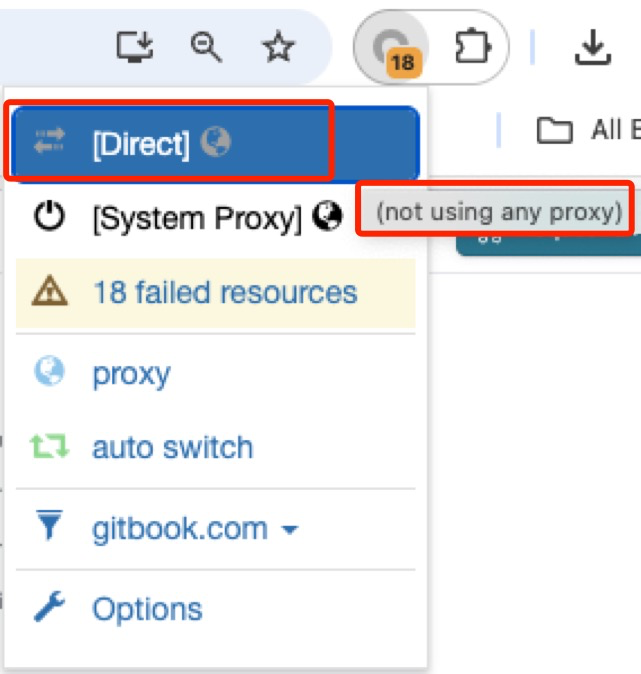

# Petoi Web Coding Blocks

## Upgrade the firmware

Please refer to the [firmware upload instructions](../../upload-firmware/) to upload the latest version of the firmware.

## **Powering On the Robot**

Please long-press the button on the battery for more than 3 seconds to power on the robot.

## Set up Petoi Web Coding Blocks

### Visit code.petoi.com

You can visit the website:  [https://code.petoi.com](https://code.petoi.com/). First, select a language, then click the **Petoi Web Coding Blocks** button.

<figure><figcaption></figcaption></figure>

Please **read the pop-up Help page carefully.**   Doing so will save you a significant amount of time later on.

<figure><figcaption></figcaption></figure>

Then, close the **Help** page.  Note that you can always go to the Help page by clicking the "?" icon in the top-right corner.

Now, you can use the web coding blocks via a USB cable connecting to the serial port.

## **Connecting the Robot via the Serial Port**

Connect the robot’s mainboard to your computer via **USB cable**.

<figure><figcaption></figcaption></figure>

Please ensure the battery is connected to the robot, then long-press the battery switch to power on the robot. (If the battery is not used, connecting the robot to the web page or WiFi may fail next.)


For **Chromebook users**, before proceeding with the next steps, you need to refer to the [Chromebook Connection Guide](./#chromebook-connection-guide) chapter and complete the **three settings** mentioned in it.


### **Establishing the Serial Connection**

<figure><figcaption></figcaption></figure>

\
Click the .png>) button in the .png>) on the webpage to establish a serial connection with the robot. Depending on your operating system, you may see the following connection pop-up windows:

* Mac\
  
* Windows\
  .png>)
* Chromebook\
  .png>)

Select the corresponding serial port as shown in the images above (you can unplug and replug the data cable connected to the robot to determine which serial port belongs to the robot). Click the "Connect" button and wait for the connection to be established.&#x20;

Once the connection is successful, you will see the serial monitor open automatically. If the connection fails, please try refreshing the webpage and repeating the steps.


If your robot restarts automatically after connecting to the serial port, please wait for the restart process to complete.


At this point, you can now use the Petoi Web Coding Blocks to program the robot, with all commands being transmitted to the robot via the serial port. If you wish to start programming directly now, please skip ahead to section [Create Your First Block-Based Programming Program](./#create-your-first-block-based-programming-program).

If you wish to control the robot wirelessly (via WiFi), please continue reading this document.

## **Connecting the Robot via** WiFi

If you want to connect the robot via **WiFi**, click the **Run Code** button. The following message box will appear; please click the **Download Local Version** button and follow the prompts to download the relevant files. Use a web browser to open the local HTML file.

<figure><figcaption></figcaption></figure>


Click the "**?**" button in the top-right corner to view the following instructions: 



### Open the Local HTML File

Unzip the PetoiWebCoding zip file and navigate to the folder **PetoiWebCoding-\[version number].**  Then open **main.html** to start programming with Petoi Web Coding Blocks in **a Google Chrome browser**.

<figure><figcaption></figcaption></figure>

<figure><figcaption></figcaption></figure>


**Note:**&#x20;

1. You must open **main.html** using **Google Chrome.**
2. Please make sure the browser is in **direct connection mode.**
3. It's best not to use a VPN, as it may slow response times and degrade the experience.



When the robot does not have your WiFi credentials stored, a serial connection is required to establish a WiFi connection. Please confirm that you have connected the robot to your computer according to the previous section "[Connecting the Robot via Serial Port](./#connecting-the-robot-via-the-serial-port)".


Once your robot completes the initial WiFi setup, it will save the WiFi information internally, allowing you to connect to the webpage to the robot via WiFi in the future.


To set up the WiFi connection for the robot for the first time, you need to perform the following steps:

### **Splitting Your WiFi Bands**

For first-time use, you need to establish a connection between your robot and computer. **Both must be on the same WiFi network, and the robot can only connect to 2.4GHz WiFi networks.** Therefore, you need to split your WiFi SSID into two frequency bands.&#x20;

**Follow these steps to split your WiFi bands:**

1. Access your router’s Wireless Settings page (the access method is typically found on the router’s label).
2. In the **2.4GHz settings**, change the WiFi name (SSID) to `xxx-2.4G` and save.
3. In the **5GHz settings**, change the SSID to `xxx-5G` and save.
4. After renaming, both `xxx-2.4G` and `xxx-5G` will appear in your device’s WiFi list.


Note: Since the WiFi names have changed, all devices connected to this router need to reconnect. If you didn’t change the password, it remains the original password.


### First-Time WiFi Connection

Please confirm that **your computer has connected to the 5G WiFi network** specified in the previous section.&#x20;

Click the .png>) button in the upper right corner, and a WiFi configuration window will pop up.&#x20;

<figure><figcaption></figcaption></figure>

Enter the name and password of your **2.4GHz** WiFi network, paying attention to capitalization, and click to wait for the connection.

<figure><figcaption></figcaption></figure>

Once the WiFi connection is successful, the robot will automatically restart to ensure the connection is available. You will see the IP address in the .png>) block in the workspace automatically updated.

Now you can start using the webpage programming blocks to write programs for the robot!


**This entire process only needs to be set up once.** The robot remembers your WiFi credentials.


### Subsequent WiFi Connections

Once your robot has stored your WiFi credentials, subsequent WiFi connections only require you to open the webpage, power on the robot, and click the .png>) button on the webpage. You will see the IP address in the .png>) block in the workspace automatically updated.

Due to potential changes in the router's IP address, the webpage may sometimes fail to connect to the robot via WiFi without a cable. Simply connect the robot to your computer with the cable and click.png>) to connect, and the new IP address will be automatically updated and saved.

Additionally, you can still use a cable for a wired connection. Petoi Web Coding Blocks will prioritize serial communication for optimal performance.


**Note**:&#x20;

The connection relies on the local network environment. Please ensure your robot is always on the same WiFi network as your computer during every subsequent connection. Your network IP address **may not always remain unchanged**. If you entered the IP address directly in the workspace block but were unable to connect, please consider any possible IP address changes.&#x20;

You may:

Connect the computer to the robot via the serial port. Send the command **w** through the Petoi Web Coding Block's serial monitor, or simply click the .png>) button to check and update the IP address.

If the local network environment changes, e.g., the WiFi SSID and password are updated. Please press and hold the **BOOT** button on the robot’s mainboard until the 10-second countdown in the serial monitor’s output ends. This will initiate the network reset procedure. It will automatically clear the WiFi SSID and password.


## Create Your First Block-Based Programming Program

Now the robot can receive instructions from the computer program! Let’s officially write your first block-based program and make it work.

### Drag the Blocks

Click on the .png>) option in the toolbox on the left, find the second block  .png>) , and drag it under the default code block in the workspace. This is the starting point of the program.

<figure><figcaption></figcaption></figure>

Click on .png>) to expand the dropdown menu and select the posture .png>). Click on .png>) and enter a number such as **3**. This will make Bittle greet and then wait for 3 seconds.

Click on the .png>) option in the toolbox on the left, find the first block labeled .png>) and drag it below the block you just added.&#x20;

Then, click on the .png>) option, find the first block .png>)(empty text block), and drag it to the right of the block you just added, like this:\
.png>) This will allow the program to output any text content to the console. Let’s click on the added text block and enter: Hello world!

<figure><figcaption></figcaption></figure>

### Run the Program

Click .png>) in the upper left corner, and you will see the program we just wrote in action: the robot greets, and after 3 seconds, the console on the right side of the webpage displays the output message "Hello World!"

<figure><figcaption></figcaption></figure>


Note: If you haven't set up WiFi for your robot and are using only a serial connection, a WiFi configuration window will appear when you first click "Run Code". Simply close the pop-up and click .png>) again to proceed.


Congratulations on completing your first block-based programming program! For a detailed introduction to using the Petoi Web Coding Blocks, please refer to the [Detailed Interface Introduction](../detailed-instructions.md).

## Chromebook Connection Guide

For Chromebook users, you may need to ensure the following **3 settings** are correct to successfully connect to the serial port and WiFi.

1. [System Settings for Serial Port Connection](./#id-1-system-settings-for-serial-port-connection)
2. [WiFi Connection Setup](./#id-2-wifi-connection-setup)
3. [Browser Settings for Serial Port Connection](./#id-3-browser-settings-for-serial-port-connection)

#### 1 System Settings for Serial Port Connection


This section applies whenever you accidentally click the "**Connect to Linux**" button in the image shown below.


When you plug in the USB cable to connect the robot to your computer, a pop-up window will appear in the lower right corner of the screen, as shown in the image. Please **do not click the "Connect to Linux" button in the pop-up window, simply close the window directly**.&#x20;

<figure><figcaption></figcaption></figure>

If you did not click this button in the pop-up window, you can skip this section and proceed directly to the [next two sections](./#id-2-wifi-connection-setup).&#x20;

If you accidentally click the button in the pop-up window, please follow the steps below.

1. Open your computer settings, scroll to the bottom of the left settings column, find "**About ChromeOS**" and click on it.&#x20;
2. Then, scroll to the bottom of the right settings content, locate the "**Linux development environment**" tab, and click to enter.

<figure><figcaption></figcaption></figure>

3. Locate the "**Manage USB devices**" tab and click to enter.

<figure><figcaption></figcaption></figure>

4. Find your robot's serial port option, like the "**USB Single Serial**" option shown in the image below. You will notice that the toggle switch for this option is in the ON position.&#x20;


If there are multiple serial port options listed here, you can identify the robot's serial port by unplugging and replugging the cable connected to the robot and observing which serial port option disappears or appears.


<figure><figcaption></figcaption></figure>

Click it to turn it off.

<figure><figcaption></figcaption></figure>

#### 2 WiFi Connection Setup

1. Click to open WiFi settings.

<figure><figcaption></figcaption></figure>

<figure><figcaption></figcaption></figure>

2. Please confirm that you have selected the 5G WiFi network to be used for connecting to the robot, such as the WiFi set here is CAT-5G. Then, scroll to the bottom, click on the "**Proxy"** tab, and switch the "**Connection type"** to "**Direct Internet Connection"**.

<figure><figcaption></figcaption></figure>

<figure><figcaption></figcaption></figure>

#### 3 Browser Settings for Serial Port Connection

1. Open your Google Chrome browser, click the **menu button** in the upper-right corner, scroll to the bottom of the pop-up menu, and find and click the "**Settings**" option to open the browser settings page. In the settings page, locate and click to open the "**Privacy and security**" tab.

<figure><figcaption></figcaption></figure>

2. Scroll down and locate the "**Additional permissions**" tab, then click to expand it.

<figure><figcaption></figcaption></figure>

3. Locate the "**Serial ports**" tab and click to open it.

<figure><figcaption></figcaption></figure>

4. Click to select the option "**Sites can ask to connect to serial ports**" to allow your browser to connect to serial ports.

<figure><figcaption></figcaption></figure>
